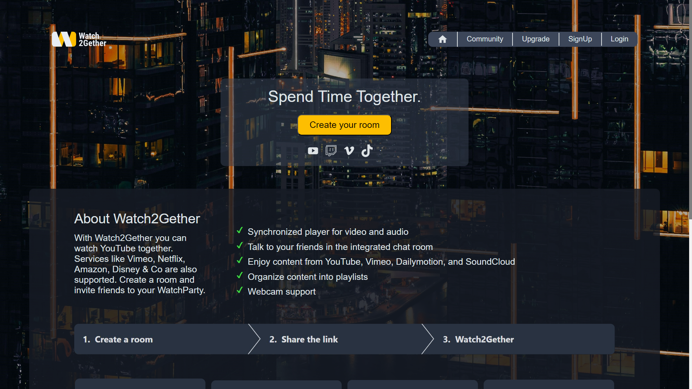
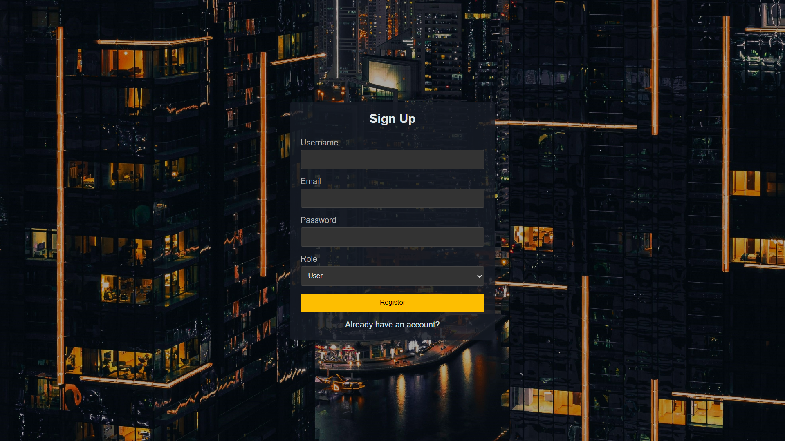
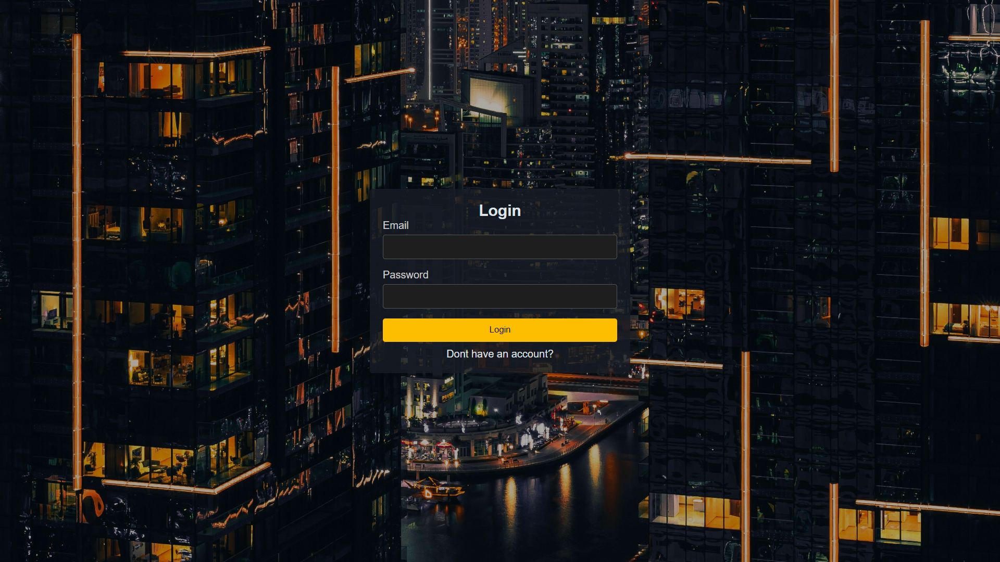
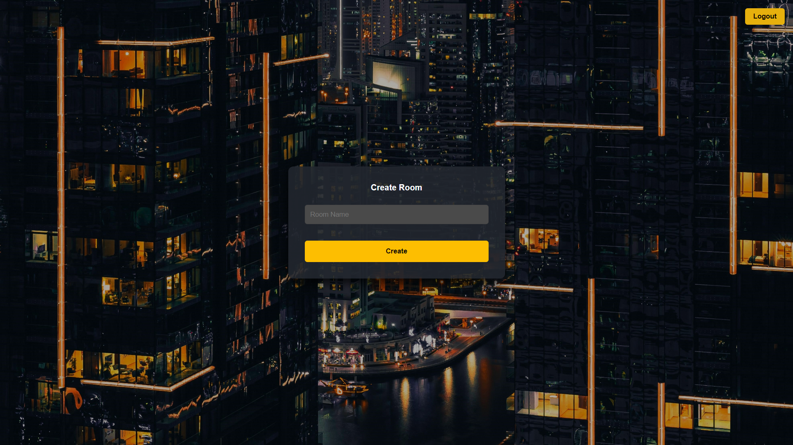
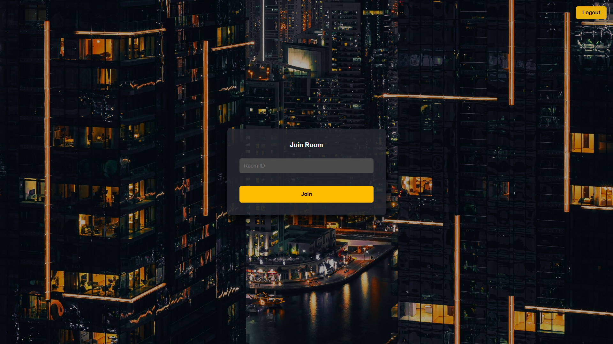
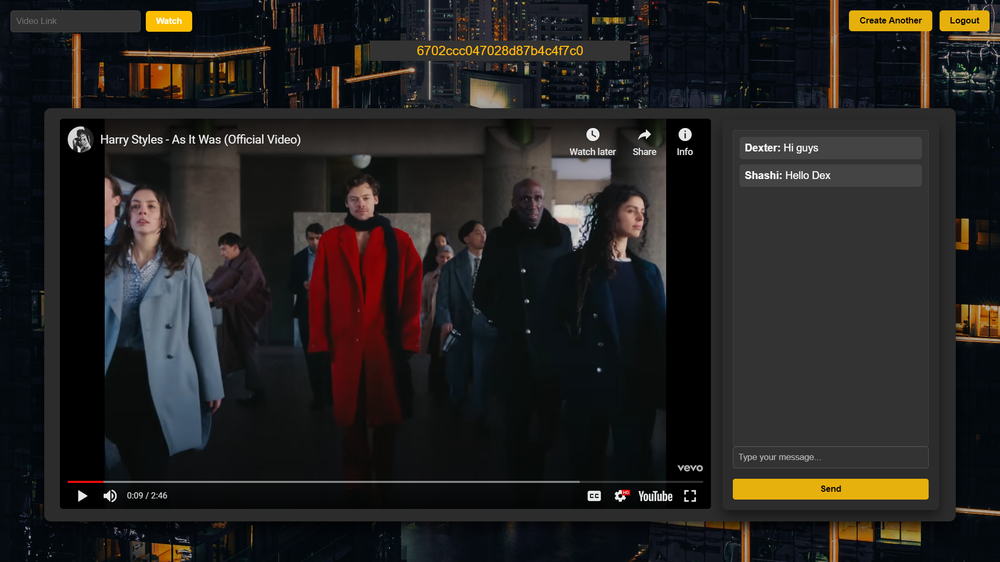
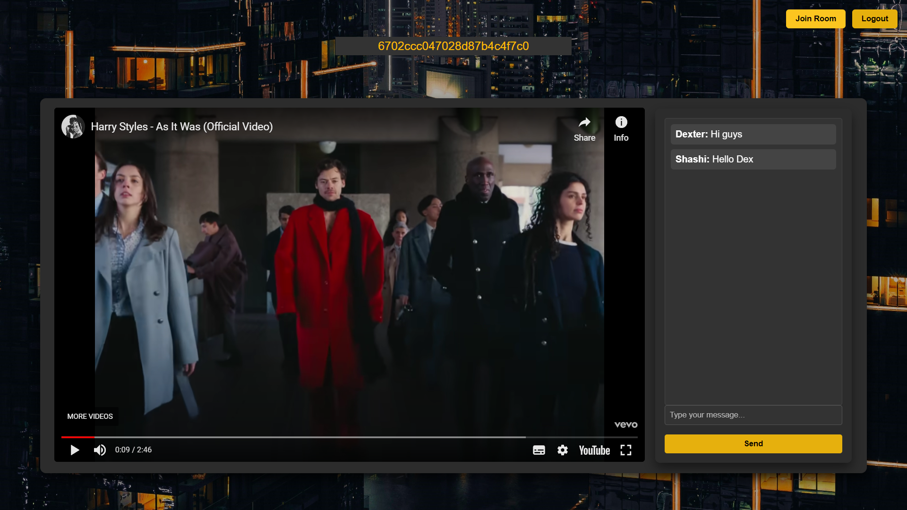

# Sync Video App
Project - Watch2Gether.

# Watch2Gether
Watch2Gether is a web application that allows users to create or join virtual rooms where they can watch YouTube videos in perfect synchronization with friends and chat in real-time. This project enhances online social interactions by providing a platform for sharing video-watching experiences, even when users are physically apart.


## Run Locally

Clone the project

```bash
  git clone https://github.com/whyshashi/Video_Sync_App.git
```

Go to the project directory

```bash
  cd Watch2Gether/Frontend
```

Install dependencies

```bash
  npm install
```

Start the server

```bash
  npm run dev
```

# Deployed Link
- https://watch-2-gether.vercel.app/


## Tech Stack

**Frontend:** HTML, CSS, JSX, REACT, axios, react-router-dom, socket.io-client, react-player
**Backend:** Nodejs, express, Render.com, Socket.io, mongodb, mongoose, cors, bcrypt, JWT, Socket.io 


# Project Type
- Full Stack MERN


# Features
<ol>
  <li>User Authentication
    <ul>
      <li>Secure login and signup</li>
      <li>User roles and permissions</li>
    </ul>
  </li>
  <li>Room Creation and Joining:
    <ul>
      <li>Users can create a room with a unique identifier and share the link for others to join.</li>
<li>Users can join an existing room using the shared link.</li>
    </ul>
  </li>
  <li>YouTube Video Sync
    <ul>
      <li>Users can paste a YouTube video link, and the video will be played in sync across all users in the room.</li>
      <li>Play, pause, and seek actions by any user are reflected for all users in real-time</li>
    </ul>
  </li>

  <li>Real-Time Chat
    <ul>
      <li>Users can chat with each other in real-time while watching the video.</li>
      <li>The chat is displayed alongside the video player.</li>
    </ul>
  </li>

  <li>Notification System:
    <ul>
      <li>Users receive notifications for new messages, users joining or leaving, and other important events.</li>
    </ul>
  </li>
</ol>


# Landing Page 

- Discover all the information about our application.



# SignUp Page
- To order any Product on our website user have to login and then can do any order .
- Signin was achieved with the help of Local storage, Nodejs and JWT .
- No user From same username can signin , he/she have to enter different username.
- Admins can create new room



# Login Page
- After successful signin For Authentication he has to login as a valid user so can do any order and can visit website.
- Login is Achieved by Local Storage, JWT and after verfication he can proceed to visit website.




# Create room
- User whose role is admin Can create room every room have unique id, by this unique id other users can join the room.



# Join Room
- User Can join room by unique room id.



# Admin room View



# User room View



# FAQ

### Is the website optimized for mobile devices?

Yes, the website is fully responsive and optimized for a seamless experience across all devices, including desktops, tablets, and smartphones.

### What is the deployment process for the website?

The website is deployed using a CI/CD pipeline through GitHub Actions, with automatic deployment to a cloud provider (Vercel) whenever changes are pushed to the main branch.

